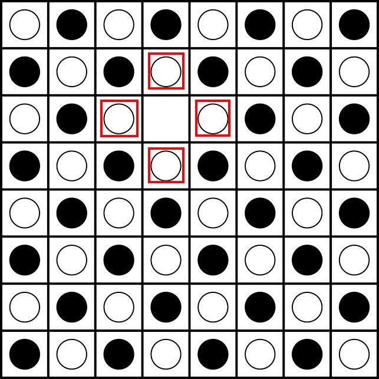
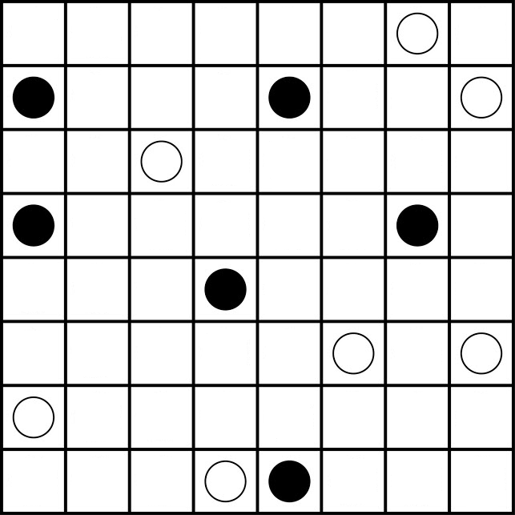

# Game Search - Project

## Introduction: Konane

Also known as Hawaiian checkers, [konane](https://en.wikipedia.org/wiki/Konane) is a strategy game played between two
players. Players alternate taking turns, capturing their opponent's pieces by jumping their own pieces over them (if 
you're familiar with checkers, there is a strong structural analogy to be made here). The first player to be unable to
capture any of their opponent's pieces loses.

The full rules can be read *[here](https://en.wikipedia.org/wiki/Konane#Rules_and_gameplay)* or
*[here](http://www.konanebrothers.com/How-to-Play.html)*. Here's my (rather terse) version, though:


1. Black typically starts. They take one of their pieces off of the board.



2. White then takes one of their pieces off of the board from a space _orthogonally_ adjacent to the piece that black
removed.


3. Each player then alternately moves their pieces in capturing moves. A capturing move has a stone move in an
orthogonal direction, hopping over an opponent's piece. Multiple captures may be made in a turn, as long as the stone
moves in the same direction and captures at least one piece.



4. The first player to be unable to capture a piece loses. :(

## Play the game


Run the following from your terminal:
```bash
python main.py $P1 $P2
```

By default, `main.py` will setup a human player versus a random player on a board that is 10x10. During **Human** mode, move the cursor with the ARROW keys and select the tile with SPACE. When it is a computer's turn, advance the game with the SPACE key. To see the game board in your terminal, you need a minimum terminal size of (rows + 2) x (columns + 2) to see the whole board. To exit the game, kill the process in your terminal (e.g., with CTRL-c).

You can change the game settings by passing in values to `python main.py`. You need to pass in _exactly_ two arguments. Valid arguments are as follows:

* H (Human)—manually select the tile to move and to where you will move it. Legal moves will be executed.
* D (Deterministic)—the agent will select the first move that it finds (the leftmost option in the tree) during its 
traversal.
* R (Random)—the agent will pick a random move.
* M (Minimax)—the agent will pick a move using the minimax algorithm. You will be prompted for a max. search depth.
* A (Alpha-beta pruning)—the agent will pick a move using AB pruning. You will be prompted for a max. search depth.

Passing in an invalid number or type of arguments will result in the system defaulting to a human vs a random player.

### Running on Windows

The `curses` module is not available on Windows.  You can try to install the package `windows-curses`:

```bash
pip install windows-curses
```

Alternatively, if you are running on Windows 10, you can install Ubuntu as a Linux subsystem.  Running your code there 
will give you access to many libraries and modules available on Linux.

**Scripted Replay**

To help with debugging and generating new tests, each play of the game automatically records all moves to `game.log`.  
The log can be helpful for comparing the sequence of moves in your implementation and in the implementation of others.  
For example, we provide a `game1.log` that is the correct sequence of moves for `test1`.  

Additionally, the logs can be used to replay a particular game by passing the log to the GameManager constructor.
In `test.py`,  you will see the `script` argument in the `makeGame` function.  This is the script used to replay
the game.  The GameManager will take moves from this script up until there are no moves left in the scripts.  At 
that point, the GameManager will continue execution with the defined players.  For examples, 
`test1s` is identical to `test1` except it is completely a scripted replay using `game1.log`.  If the last two
moves in `game1.log` were removed, then the Minimax player and the Deterministic player would make one more move 
(which should then match the two moves that were just removed).

This means you can use truncated log files to create specific test scenarios by replaying a previous game up to a 
given point.  This can be helpful if you know the first *n* moves are correct and then you want to debug the *n+1* move.
You may also want to consider creating test cases in a similar fashion.  You can edit the log to create a new path of
play and verify the game outcome from there.

